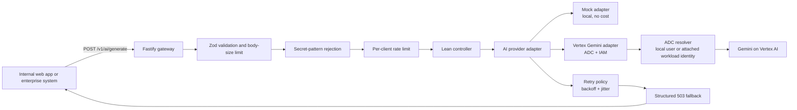
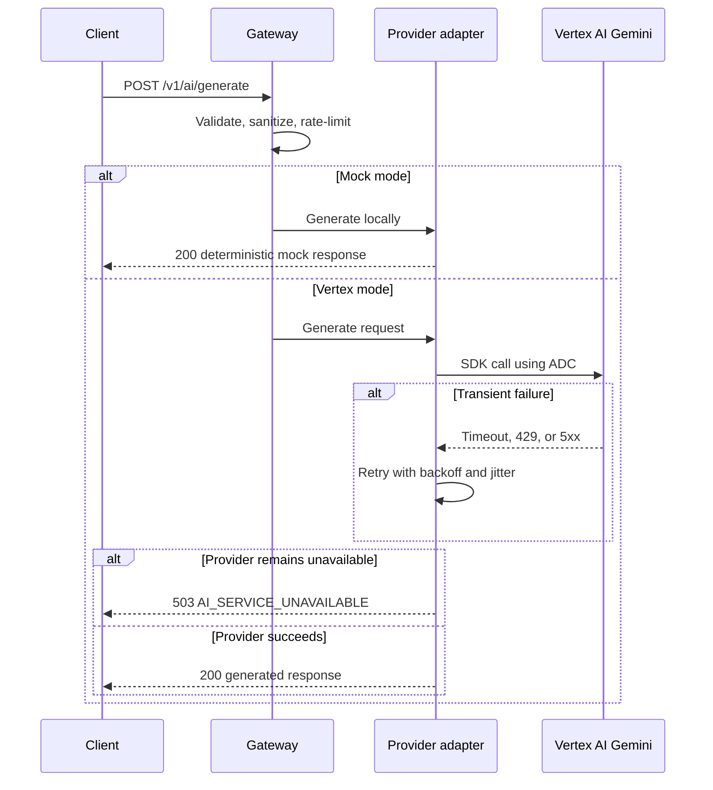

# GCP AI Integration Gateway

A **mock-first TypeScript API gateway** that demonstrates how an enterprise application can invoke Gemini on Google Cloud Vertex AI without hard-coded API keys or user-managed service-account files. The gateway applies payload validation, likely-secret rejection, per-client rate limits, transient-error retries, and a safe fallback response before returning data to a client.

> **Portfolio focus:** Application Default Credentials (ADC), least-privilege IAM, provider isolation, secure payload routing, resiliency, and an explicit OpenAPI contract.

## What this repository demonstrates

| Concern | Implementation |
|---|---|
| Cloud identity | The Vertex adapter initializes Google’s official Gen AI SDK in Vertex AI mode. It relies on ADC rather than accepting an API key, service-account JSON, or credential file path in application configuration. |
| Safe local development | `AI_PROVIDER=mock` is the default. It produces deterministic local responses and never sends prompt content to Google Cloud. |
| Input controls | Zod validates request shape and size. A conservative secret detector rejects likely private keys, OAuth tokens, API keys, authorization headers, passwords, and secrets before provider invocation. |
| Rate limiting | Fastify rate limiting applies a configurable quota to each `X-Client-Id` value or source IP. The header is a quota partition key, not authentication. |
| Resiliency | The Vertex adapter retries only timeouts, `429` rate limits, and temporary provider failures with capped exponential backoff and jitter. |
| Failure behavior | After retries are exhausted, the API returns `503 AI_SERVICE_UNAVAILABLE`. It does not invent a generated response. |
| Client contract | [`docs/openapi.yaml`](docs/openapi.yaml) defines all endpoint, request, success, validation, rate-limit, and fallback responses. |

## Secure payload-routing architecture



The gateway’s secret-detection step is deliberately conservative. It is a first-line guard that prevents obvious credentials from leaving the application boundary. It is **not** a replacement for an organization’s data-loss-prevention policy.

## Request lifecycle



## Project structure

```text
src/
├── Auth/
│   └── ApplicationDefaultCredentialsManager.ts  # Creates the official SDK client in ADC mode
├── Controllers/
│   └── AiGenerationController.ts                # HTTP request and response coordination
├── Middleware/
│   ├── PayloadSanitizationMiddleware.ts         # Likely-secret rejection
│   └── SecurityHeadersMiddleware.ts             # No-store and browser hardening headers
├── Services/
│   ├── AiGenerationClient.ts                    # Provider contract and typed errors
│   ├── AiProviderFactory.ts                     # Selects mock or Vertex adapter
│   ├── MockAiGenerationClient.ts                # Free deterministic local implementation
│   ├── RetryPolicy.ts                           # Exponential backoff with jitter
│   └── VertexAiGeminiClientAdapter.ts           # Vertex AI Gemini implementation
├── app.ts                                       # Fastify application factory
├── config.ts                                    # Validated configuration
└── server.ts                                    # Process entry point

docs/
├── openapi.yaml                                 # API contract
└── security-design.md                           # Trust boundaries and non-goals

tests/                                           # Gateway and retry behavior tests
```

## Run locally in mock mode — no cloud account required

### Prerequisites

Install **Node.js 22 or later**. No Google Cloud account, API key, Docker installation, or service-account key is needed for this mode.

```bash
git clone https://github.com/shallow2024/gcp-ai-integration-gateway.git
cd gcp-ai-integration-gateway
npm install
```

Create your local configuration file:

```bash
cp .env.example .env
```

On Windows PowerShell, use:

```powershell
Copy-Item .env.example .env
```

Keep the default value below:

```env
AI_PROVIDER=mock
```

Start the API:

```bash
npm run dev
```

The gateway listens on `http://localhost:3000`.

### Call the mock gateway

```bash
curl --request POST http://localhost:3000/v1/ai/generate \
  --header 'Content-Type: application/json' \
  --header 'X-Client-Id: local-demo' \
  --data '{
    "prompt": "Summarize this internal incident in three bullet points.",
    "max_output_tokens": 256
  }'
```

A successful mock response looks like this:

```json
{
  "request_id": "req-1",
  "status": "completed",
  "data": {
    "output": "Mock response: request accepted for secure processing...",
    "provider": "mock",
    "model": "local-deterministic-mock-v1"
  }
}
```

In Windows PowerShell, the same call is easier with `Invoke-RestMethod`:

```powershell
$body = @{
  prompt = "Summarize this internal incident in three bullet points."
  max_output_tokens = 256
} | ConvertTo-Json

Invoke-RestMethod `
  -Uri "http://localhost:3000/v1/ai/generate" `
  -Method Post `
  -Headers @{ "X-Client-Id" = "local-demo" } `
  -ContentType "application/json" `
  -Body $body
```

## Use Vertex AI Gemini with ADC — optional live mode

Use this mode only when you are ready to call a real Google Cloud model. Google documents that a project with billing enabled, the Vertex AI / Agent Platform API enabled, and ADC are required. [1]

1. Create or select a Google Cloud project and enable the Vertex AI API.
2. Give the calling identity only the permissions it needs. The usual starting role for inference is **Vertex AI User** (`roles/aiplatform.user`). [2]
3. Install and initialize the Google Cloud CLI:

   ```bash
   gcloud init
   gcloud config set project YOUR_PROJECT_ID
   gcloud services enable aiplatform.googleapis.com
   gcloud auth application-default login
   ```

4. Update your uncommitted `.env` file:

   ```env
   AI_PROVIDER=vertex
   GOOGLE_CLOUD_PROJECT=YOUR_PROJECT_ID
   GOOGLE_CLOUD_LOCATION=global
   VERTEX_MODEL=gemini-2.5-flash
   ```

5. Start the server again with `npm run dev`.

The code does not require `GEMINI_API_KEY`, `GOOGLE_API_KEY`, `GOOGLE_APPLICATION_CREDENTIALS`, a downloaded service-account JSON key, or a credential path. Locally, Google’s SDK resolves the ADC created by `gcloud auth application-default login`. In production, deploy the process on a Google Cloud runtime with an **attached dedicated service account** instead of exporting a long-lived key. Google’s SDK supports Node.js access to Gemini on Vertex AI through this ADC-based configuration. [1] [3]

## Test and build

```bash
npm test
npm run build
```

The suite covers seven behaviors:

1. Health readiness without an AI call.
2. Successful generation through an injected adapter.
3. Rejection of likely credentials before provider invocation.
4. Structured fallback after an unavailable provider.
5. Per-client rate-limit enforcement.
6. Exponential retry after rate-limit failures.
7. No retry for a non-transient error.

## API contract and responses

View the versioned contract at [`docs/openapi.yaml`](docs/openapi.yaml). The principal response states are:

| HTTP status | Code or state | Meaning |
|---:|---|---|
| `200` | `completed` | The configured provider returned text. |
| `400` | `VALIDATION_ERROR` | Request shape, field types, or field length is invalid. |
| `400` | `SENSITIVE_PAYLOAD_REJECTED` | A likely credential or private key was detected before forwarding. |
| `429` | `RATE_LIMITED` | The client quota was exceeded. |
| `503` | `AI_SERVICE_UNAVAILABLE` | Transient retries failed; the API returns no invented AI content. |

## Production hardening path

This repository intentionally stays small enough to review. Before using it as an internet-facing or multi-tenant service, add client authentication and authorization, a distributed rate-limit store such as Redis, an upstream gateway or identity-aware proxy, organization-specific data-loss prevention, tenant-specific quotas, audit-log export, monitoring, alerting, and secret management. See [`docs/security-design.md`](docs/security-design.md) for the defined boundary and non-goals.

## License

Distributed under the [MIT License](LICENSE).

## References

[1]: https://docs.cloud.google.com/gemini-enterprise-agent-platform/models/start/gcp-auth "Configure Application Default Credentials for Gemini on Vertex AI"
[2]: https://docs.cloud.google.com/iam/docs/roles-permissions/aiplatform "Gemini Enterprise Agent Platform roles and permissions"
[3]: https://github.com/googleapis/js-genai "Google Gen AI JavaScript SDK for Gemini and Vertex AI"
